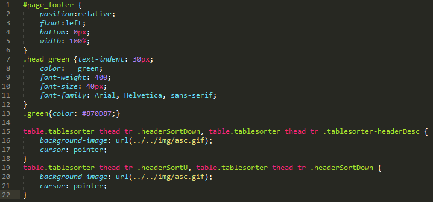

# UnusedCssFinder
[](https://github.com/CodeByZach/sublime_unused_css_finder/releases)

Sublime Text plugin to find unused css names

Plugin to find unused css declarations in a project. Searches for all id and class names inside current open project or file directory if no project is currently open. All css names that do not occur once in any other .php, .html, .xhtml or .js file will be selected.



Might run slow on big projects, do not hesitate to send me improvement recommendations as this is my first sublime plugin.

### Usage

`Inline CSS`: Open the file and press <kbd>Cmd</kbd>/<kbd>Ctrl</kbd>+<kbd>U</kbd>+<kbd>F</kbd> to find css declarations without any occurence in the current file.

`Extern CSS`: Open any `.css` file and press <kbd>Cmd</kbd>/<kbd>Ctrl</kbd>+<kbd>U</kbd>+<kbd>F</kbd> to find css declarations without any occurence in the current project. If no project is active, the search takes place at the css file location.

### Default Key Bindings

for Mac:
```
{ "keys": ["super+u", "super+f"], "command": "unused_css_finder"}
```

for Windows/Linux:
```
{ "keys": ["ctrl+u", "ctrl+f"], "command": "unused_css_finder"}
```


### Settings

- `unused_css_root_folder`: define a projects root location if ti deviates from the sublime projects root location.
- `unused_css_ignore_folders`: any folder added here will be ignored in the search for occurences of the css names.
- `unused_css_scan_only_folders`: if you want to search explicitly in only some folder, define them here and a search will only happen in a folder, it its name is in this list. **Important**: Add them as object with the folders being the keys and a boolean as value. The boolean defines, if all subfolders in this folder are allowed to be included in the search.
- `unused_css_ignore_selectors`: define any selectors, that should be ignored in the search. Can be defined with class or id selcetor or as plain selector name. (e.g. "#example", ".example" or "example")
- `unused_css_highlight_selectors`: if true, the found selectors won't be selected via cursor but highlighted. The highlighting can be removed by running the same command again.


- `unused_css_delete_on_search`: deletes all unused selectors after search if true. Be sure to add composited html classes and ids to the ignored selectors list. e.g. if you have a class declaration like "test_"+true_or_false, add "test_false" and "test_true" to ignore - they would be deleted otherwise.


*All these settings can be configured over the context menu on right click also. Clicking "Add To Selectors Ignore List" will add all selected elements to the list.*

### Project Settings

You can also define all the above settings in an individual "unused_css.cfg" file for each project, that needs to be located in the projects rootpath. All settings in the file will be appended to the default/user settings or override the settings, if it's a boolean value.


### License

This work is licensed under the [The MIT License](LICENSE).
